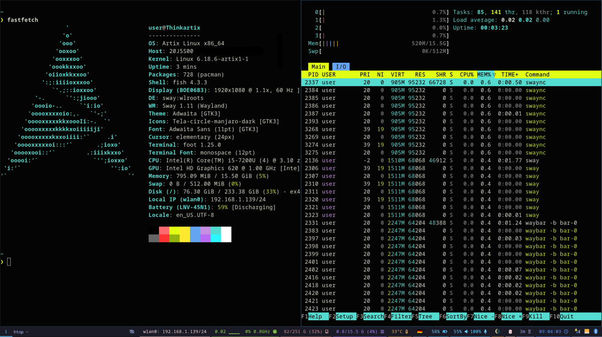

NOTE: this repo is now hosted mainly on [Codeberg](https://codeberg.org/haditim/dotfiles) and [GitHub](https://github.com/haditim/dotfiles) serves as its mirror.

# dot files

These are my personal dotfiles for a light-weight desktop environment with
Sway. The config is tested with Debian, Arch, Artix and Void GNU/Linux distros
using Systemd or OpenRC as well as FreeBSD and OpenBSD although in distros or
OSs other than Debian, Arch, Artix some adjustments may be needed to get
everything working.

I put a strong emphasis on resources consumption by the system on idle. This
dotfiles usually provides me with a running system with ~250MB memory usage
without network manager / blueman and udiskie applets and ~500MB with applets
loaded to tray (default).



## Requirements

### Packages

- Sway
  - `swaync`, `swaylock`, `swayidle`, `cliphist`, `pcmanfm`,
    `rofi`, `lxqt-policykit`, `lxappearance`
- Notifications
  - `brightnessctl`, `libnotify`, `playerctl`
- Menu bar
  - Waybar (default)
    - `udiskie`, `network-manager-applet`, `htop`, `noto-fonts`, `noto-fonts-emoji`
  - or i3status (uncomment in settings to replace waybar)
- Audio
  - `pipewire`, `wireplumber`, `pipewire-pulse`, `pipewire-alsa`, `bluez`,
    `blueman`, `pulseaudio-utils`
- Screen sharing
  - `xdg-desktop-portal-wlr`, `xdg-user-dirs`
- Screenshot
  - `slurp`, `grim`
- mpv
  - `intel-media-driver` for vaapi video hardware acceleration on intel
- Terminal
  - `foot`, `fish`, `starship`
- Display manager
  - `sddm` (optional): if not installed, run sway with command `dbus-run-session
    sway` for screen sharing to work

### Post installation steps

Make sure `pipewire`, `pipewire-pulse`, `wireplumber` and `bluetoothd` run as
user services. This can be achieved on OpenRC by `rc-update add -U <service>
default` run for each service. For systemd these usually get added automatically.

Also make sure `NetworkManager` and `sddm` (in case installed) are enabled by
`rc-update add <service>`.

#### Test WebRTC screen sharing

Screen sharing can be tested via [WebRTC test landing page](https://mozilla.github.io/webrtc-landing/).

# sway
Install requirements mentioned above. The display config can be changed in
`~/.config/sway/outputs` by running `swaymsg -t get_outputs` after wdisplays has
the changes you'd want.

## Key bindings
Keybinds can be checked in `.config/sway/config.d/20-keybindings.conf`.

## Set dark theme
To set dark theme for both GTK and Qt run the following:
```shell
gsettings set org.gnome.desktop.interface gtk-theme 'Adwaita'

gsettings set org.gnome.desktop.interface color-scheme 'prefer-dark'
# default is
# gsettings set org.gnome.desktop.interface gtk-theme 'Breeze'
```

# fish
I currently use fish as my main shell. It is set up to support vterm inside
emacs with starship. My aliases and functions are also included in the
config. If you need to move your zsh history to shell, you can use
[zsh-history-to-fish](https://pypi.org/project/zsh-history-to-fish/).

## shell
Default shell can be changed by `chsh -s /usr/bin/fish`.

## Starship
Install Starship for a nice prompt while keeping zsh plugins/fish/vterm working
From [Starship website](https://starship.rs/) or just run `sudo pacman -Sy
starship` if you're on Arch (BTW). If starship is not desired, the entry form
the following lines from the file `~/.config/fish/conf.d/main.fish`.

```shell
# Run Starship (before emacs)
starship init fish | source
```

## Stop annoyances when using X11 over SSH (only for Gnome desktop)

Delay the time for an app to actually not respond and Gnome showing
`"Application" is not responding.`. This is very important if you run any X11
forwarding over SSH. Taken from
[askubuntu](https://askubuntu.com/questions/1068921/how-to-disable-the-window-not-responding-dialog). Also
don't forget to have `xorg-x11-xauth` installed.

``` shell
# for a 60s delay
gsettings set org.gnome.mutter check-alive-timeout 60000
```

# Waybar

Waybar uses noto sans mono font. Install `noto-fonts-emoji` package for all
icons to show correctly.

# emacs

My main emacs configuration can be found in [my dotemacs
repository](https://codeberg.org/haditim/dotemacs) which can be cloned to
`.config/emacs`.

# how to use
I use something like the following to track my changes on dot files (mostly
taken from
[this](https://medium.com/toutsbrasil/how-to-manage-your-dotfiles-with-git-f7aeed8adf8b)
page).

## new setup
This repo is setup like following (for reference).

``` sh
git init --bare $HOME/.dotfiles
alias dotfiles='/usr/bin/git --git-dir=$HOME/.dotfiles/ --work-tree=$HOME'
dotfiles config --local status.showUntrackedFiles no
echo "alias dotfiles='/usr/bin/git --git-dir=$HOME/.dotfiles/ --work-tree=$HOME'" >> $HOME/.bashrc
echo "alias dotfiles='/usr/bin/git --git-dir=$HOME/.dotfiles/ --work-tree=$HOME'" >> $HOME/.zshrc

dotfiles remote add origin https://codeberg.org/haditim/dotfiles
git push --set-upstream origin master
```

## to checkout from codeberg/github

``` sh
git clone --bare https://codeberg.org/haditim/dotfiles.git $HOME/.dotfiles
alias dotfiles='/usr/bin/git --git-dir=$HOME/.dotfiles/ --work-tree=$HOME'
dotfiles checkout
```
